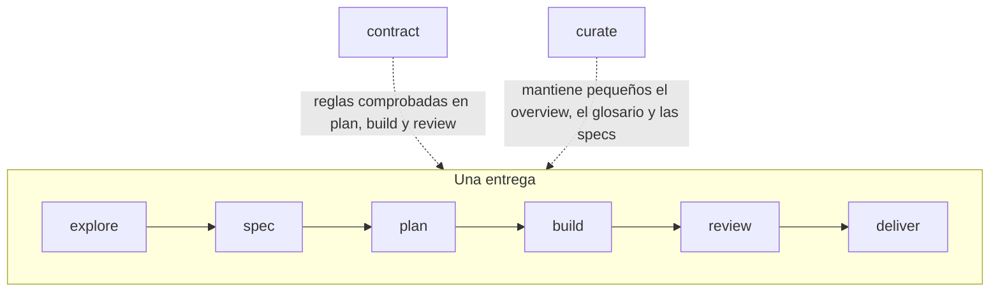

# El flujo

Nueve fases. Siete forman el camino de una entrega, con `fix` como el camino
corto para un defecto; dos son transversales. Cada fase tiene una palabra, y
esa palabra es el comando del CLI, el fichero de workflow, el skill y el rol.
Invocas una fase con su skill; el skill ejecuta el comando de la fase; el
comando se niega mientras falte un paso obligatorio y, si no, imprime el
workflow, las reglas y el contexto.



| Fase | Dile a tu cliente | Produce | Quién decide |
| --- | --- | --- | --- |
| [explore](explore.md) | `/atipspec-explore <slug>: <idea>` | `brief.md` | tú: haz la spec, acótala o descártala |
| [spec](spec.md) | `/atipspec-spec <slug>: <what you want>` | `spec.md` con `status: ready` | tú apruebas. **Punto de parada 1** |
| [fix](fix.md) | `/atipspec-fix <slug>: <the defect>` | `spec.md` con un criterio de regresión, un plan de una tarea | tú apruebas la spec; sin aceptación de plan |
| [plan](plan.md) | `/atipspec-plan <slug>` | `plan.md` | tú, cuando `approve_plan` está activado |
| [build](build.md) | `/atipspec-build <slug>` | código, evidencia, commits | el desarrollador |
| [review](review.md) | `/atipspec-review <slug>` | `review.md` por el revisor | `atipspec check` |
| [deliver](deliver.md) | `/atipspec-deliver <slug>` | spec viva actualizada, carpeta archivada | tú fusionas. **Punto de parada 2** |
| [contract](contract.md) | `/atipspec-contract` | `contract.md`, decisiones | tú apruebas |
| [curate](curate.md) | `/atipspec-curate` | `overview.md`, `glossary.md` | el modelo, dentro de los topes |

## Qué requiere cada fase

El comando de la fase comprueba esto antes de imprimir nada. Cuando falta
algo, termina con código 1 y una sola línea que nombra el paso y quién lo
resuelve.

| Comando | Requiere |
| --- | --- |
| `atipspec explore <slug>` | que la entrega exista (`atipspec new`) |
| `atipspec spec <slug>` | que el contrato esté aceptado (`atipspec accept contract`) |
| `atipspec fix <slug>` | que el contrato esté aceptado y que la entrega se haya creado con `--kind fix` |
| `atipspec plan <slug>` | que la spec esté aceptada para su contenido actual (`atipspec accept <slug> spec`) |
| `atipspec build <slug>` | un plan con tareas y sin errores de plan, aceptado con `atipspec accept <slug> plan` cuando `approve_plan` está activado; nombra la siguiente tarea sin commit |
| `atipspec review <slug>` | que cada tarea tenga commit, la evidencia esté fresca, y no haya violación del contrato; solo entonces escribe el paquete |
| `atipspec deliver <slug> --policy ...` | que la puerta de confianza esté en verde |
| `atipspec contract`, `atipspec curate` | nada |
| `atipspec ship <slug>` | que la entrega exista; imprime la siguiente fase a la que entrar |

## Modo ship

```text
/atipspec-ship <slug>
```

`atipspec ship <slug>` nombra la siguiente fase a la que la entrega puede
entrar; el modelo entra en ella, la termina y vuelve a preguntar. Ejecuta
plan, build, review y deliver sin pausar, salvo en los dos puntos de parada,
en la aprobación del plan cuando `approve_plan` está activado, y ante
preguntas que cambian la spec. Termina con un informe: qué cambió, la
evidencia, el resultado de la revisión, los elementos aplazados, la
siguiente acción.

## Puntos de parada

!!! warning "Punto de parada 1: la spec"
    Nada se planifica ni se construye hasta que apruebas la spec ejecutando
    `atipspec accept <slug> spec`. El comando pone `status: ready` y
    registra lo que aceptaste; el modelo nunca lo ejecuta. Aquí es donde una
    idea equivocada cuesta menos.

!!! warning "Punto de parada 2: la fusión"
    `deliver` actualiza la spec viva y archiva la entrega en su branch. Una
    persona fusiona la branch. AtipSpec nunca hace push ni fusiona.

## Roles

Cada workflow empieza con el rol que el modelo adopta en esa fase: quién es,
qué le importa, a qué se resiste. La fase activa el rol, no tú, así que no
hay ninguna persona que invocar; el comando de la fase imprime la fase que
abre («Phase spec: Password reset») para que siempre sepas quién habla.
