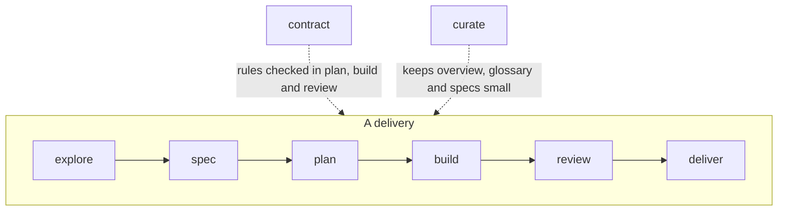

# The flow

Nine phases. Seven form the path of a delivery, with `fix` as the short
road for a defect; two are transversal. Each
phase has one word, and that word is the CLI command, the workflow file, the
skill and the role. You invoke a phase with its skill; the skill runs the
phase command; the command refuses while a required step is missing and
otherwise prints the workflow, the rules and the context.



| Phase | Say to your client | Produces | Who decides |
| --- | --- | --- | --- |
| [explore](explore.md) | `/atipspec-explore <slug>: <idea>` | `brief.md` | you: spec it, narrow it or drop it |
| [spec](spec.md) | `/atipspec-spec <slug>: <what you want>` | `spec.md` with `status: ready` | you approve. **Stop point 1** |
| [fix](fix.md) | `/atipspec-fix <slug>: <the defect>` | `spec.md` with one regression criterion, a one-task plan | you approve the spec; no plan acceptance |
| [plan](plan.md) | `/atipspec-plan <slug>` | `plan.md` | you, when `approve_plan` is on |
| [build](build.md) | `/atipspec-build <slug>` | code, evidence, commits | the developer |
| [review](review.md) | `/atipspec-review <slug>` | `review.md` by the reviewer | `atipspec check` |
| [deliver](deliver.md) | `/atipspec-deliver <slug>` | living spec updated, folder archived | you merge. **Stop point 2** |
| [contract](contract.md) | `/atipspec-contract` | `contract.md`, decisions | you approve |
| [curate](curate.md) | `/atipspec-curate` | `overview.md`, `glossary.md` | the model, within caps |

## What each phase requires

The phase command checks these before printing anything. When one is
missing, it exits 1 with a single line naming the step and who resolves it.

| Command | Requires |
| --- | --- |
| `atipspec explore <slug>` | the delivery exists (`atipspec new`) |
| `atipspec spec <slug>` | the contract is accepted (`atipspec accept contract`) |
| `atipspec fix <slug>` | the contract is accepted and the delivery was created with `--kind fix` |
| `atipspec plan <slug>` | the spec is accepted for its current content (`atipspec accept <slug> spec`) |
| `atipspec build <slug>` | a plan with tasks and no plan errors, accepted with `atipspec accept <slug> plan` when `approve_plan` is on; it names the next task without a commit |
| `atipspec review <slug>` | every task committed, evidence fresh, no contract violation; only then it writes the packet |
| `atipspec deliver <slug> --policy ...` | the trusted gate is green |
| `atipspec contract`, `atipspec curate` | nothing |
| `atipspec ship <slug>` | the delivery exists; prints the next phase to enter |

## Ship mode

```text
/atipspec-ship <slug>
```

`atipspec ship <slug>` names the next phase the delivery can enter; the model
enters it, finishes it and asks again. It runs plan, build, review and deliver
without pausing, except at the two stop points, at the plan approval when
`approve_plan` is on, and for questions that change the spec. It ends with one
report: what changed, evidence, review outcome, deferred items, next action.

## Stop points

!!! warning "Stop point 1: the spec"
    Nothing is planned or built until you approve the spec by running
    `atipspec accept <slug> spec`. The command sets `status: ready` and
    records what you accepted; the model never runs it. This is where a
    wrong idea costs the least.

!!! warning "Stop point 2: the merge"
    `deliver` updates the living spec and archives the delivery on its
    branch. A person merges the branch. AtipSpec never pushes or merges.

## Roles

Each workflow opens with the role the model adopts in that phase: who it is,
what it cares about, what it pushes back on. The phase triggers the role, not
you, so there is no persona to summon; the phase command prints the phase it
opens ("Phase spec: Password reset") so you always know who is speaking.
