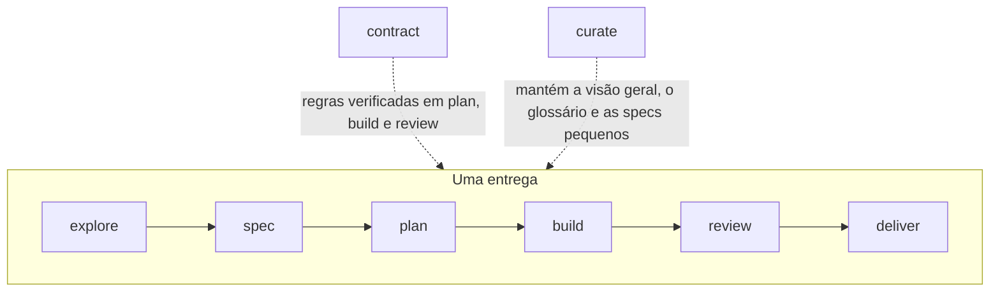

# O fluxo

Nove fases. Sete formam o caminho de uma entrega, com `fix` como o caminho
curto para um defeito; duas são transversais. Cada fase tem uma palavra, e
essa palavra é o comando da CLI, o arquivo de workflow, a skill e o papel.
Você invoca uma fase com sua skill; a skill executa o comando da fase; o
comando recusa enquanto um passo obrigatório estiver faltando e, caso
contrário, imprime o workflow, as regras e o contexto.



| Fase | O que dizer ao seu cliente | Produz | Quem decide |
| --- | --- | --- | --- |
| [explore](explore.md) | `/atipspec-explore <slug>: <idea>` | `brief.md` | você: faça a spec, reduza o escopo ou descarte |
| [spec](spec.md) | `/atipspec-spec <slug>: <what you want>` | `spec.md` com `status: ready` | você aceita. **Ponto de parada 1** |
| [fix](fix.md) | `/atipspec-fix <slug>: <the defect>` | `spec.md` com um critério de regressão, um plano de uma tarefa | você aceita a spec; sem aceitação de plano |
| [plan](plan.md) | `/atipspec-plan <slug>` | `plan.md` | você, quando `approve_plan` está ativo |
| [build](build.md) | `/atipspec-build <slug>` | código, evidência, commits | o desenvolvedor |
| [review](review.md) | `/atipspec-review <slug>` | `review.md` pelo revisor | `atipspec check` |
| [deliver](deliver.md) | `/atipspec-deliver <slug>` | spec viva atualizada, pasta arquivada | você faz o merge. **Ponto de parada 2** |
| [contract](contract.md) | `/atipspec-contract` | `contract.md`, decisões | você aceita |
| [curate](curate.md) | `/atipspec-curate` | `overview.md`, `glossary.md` | o modelo, dentro dos limites |

## O que cada fase exige

O comando da fase verifica isso antes de imprimir qualquer coisa. Quando um
deles está faltando, ele sai com código 1 e uma única linha nomeando o
passo e quem o resolve.

| Comando | Exige |
| --- | --- |
| `atipspec explore <slug>` | a entrega existe (`atipspec new`) |
| `atipspec spec <slug>` | o contrato está aceito (`atipspec accept contract`) |
| `atipspec fix <slug>` | o contrato está aceito e a entrega foi criada com `--kind fix` |
| `atipspec plan <slug>` | a spec está aceita para o conteúdo atual (`atipspec accept <slug> spec`) |
| `atipspec build <slug>` | um plano com tarefas e sem erros de plano, aceito com `atipspec accept <slug> plan` quando `approve_plan` está ativo; ele nomeia a próxima tarefa sem commit |
| `atipspec review <slug>` | toda tarefa commitada, evidência atualizada, nenhuma violação do contrato; só então ele escreve o pacote |
| `atipspec deliver <slug> --policy ...` | o portão confiável está verde |
| `atipspec contract`, `atipspec curate` | nada |
| `atipspec ship <slug>` | a entrega existe; imprime a próxima fase a entrar |

## Modo ship

```text
/atipspec-ship <slug>
```

`atipspec ship <slug>` nomeia a próxima fase que a entrega pode entrar; o
modelo entra nela, termina e pergunta de novo. Ele executa plan, build,
review e deliver sem pausar, exceto nos dois pontos de parada, na aceitação
do plano quando `approve_plan` está ativo, e para perguntas que mudam a
spec. Termina com um relatório: o que mudou, evidência, resultado do
review, itens adiados, próxima ação.

## Pontos de parada

!!! warning "Ponto de parada 1: a spec"
    Nada é planejado ou construído até você aceitar a spec executando
    `atipspec accept <slug> spec`. O comando define `status: ready` e
    registra o que você aceitou; o modelo nunca o executa. É aqui que uma
    ideia errada custa menos.

!!! warning "Ponto de parada 2: o merge"
    `deliver` atualiza a spec viva e arquiva a entrega em seu branch. Uma
    pessoa faz o merge do branch. O AtipSpec nunca faz push ou merge.

## Papéis

Cada workflow começa com o papel que o modelo adota naquela fase: quem ele
é, com o que se importa, o que ele contesta. A fase aciona o papel, não
você, então não há persona para invocar; o comando da fase imprime a fase
que abre ("Phase spec: Password reset") para que você sempre saiba quem
está falando.
