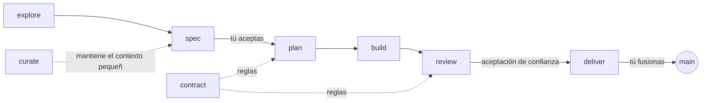

# AtipSpec

**Entrega dirigida por especificación para clientes de programación con LLM.
El desarrollador dirige, el modelo propone, el CLI comprueba la evidencia y
la aceptación de confianza.**

Sigues hablando con el cliente de programación que ya usas: Claude Code,
Codex, Cursor, GitHub Copilot, Gemini CLI o Antigravity. AtipSpec da al
modelo un manual de operación corto, un workflow por fase y una herramienta
de línea de comandos que posee todo lo que no debe depender del juicio del
modelo.

-   :material-file-document-check: **La spec es la verdad**

    Cada entrega empieza con requisitos y criterios de aceptación que aceptas
    con un comando; si alguien los edita después, la puerta te vuelve a
    preguntar. El revisor juzga el código contra ellos, criterio a criterio.

-   :material-shield-check: **El contrato es la ley**

    Un contrato de arquitectura con reglas comprobadas por máquina: stack,
    capas, dependencias, comandos obligatorios. La deriva se rechaza, no se
    discute.

-   :material-check-decagram: **Evidencia con procedencia autenticada**

    `atipspec verify` ejecuta tus comandos de test y registra los códigos de
    salida atados al árbol de trabajo. El éxito local es `checked`;
    `verified` exige además evidencia de CI firmada y aprobaciones humanas
    atadas al contenido.

-   :material-source-branch: **Git es la máquina de estados**

    Una tarea está hecha cuando un commit lo dice. Sin fichero de estado,
    nada que reanudar, nada que perder.

-   :material-account-eye: **Una revisión adversarial**

    Un revisor en un contexto limpio lee un paquete, no tu conversación, y
    escribe un PASS o FAIL por criterio.

-   :material-scale-balance: **Un contexto que se mantiene pequeño**

    `atipspec context` carga exactamente lo que una entrega necesita y lo
    mide contra un presupuesto. El coste depende de la entrega, no de la
    edad del proyecto.

## El flujo en treinta segundos

1. **explore** una idea que aún no está clara, si hace falta.
2. **spec** con el modelo en una entrevista; aceptas la spec con
   `atipspec accept`, o **fix** un defecto sin entrevista.
3. **plan** las tareas dentro del contrato, con los ficheros que van a tocar.
4. **build** tarea a tarea; cada tarea termina con evidencia y un commit.
5. **review** por un revisor que no escribió el código.
6. **deliver**: la spec viva se actualiza, la entrega se archiva, tú fusionas.

La aceptación humana es explícita: producto acepta la spec, ingeniería el
plan y QA el candidato revisado con evidencia de CI atestada. Consulta la
[aceptación empresarial](enterprise.md) para configurar el perímetro de
confianza.

[Instalar AtipSpec](getting-started/installation.md){ .md-button .md-button--primary }
[Primeros pasos](getting-started/quick-start.md){ .md-button }
