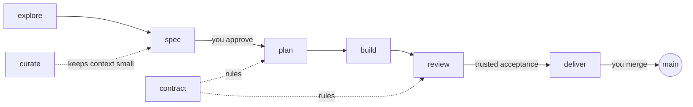

# AtipSpec

**Spec-driven delivery for LLM coding clients. The developer leads, the model
proposes, the CLI checks evidence and trusted acceptance.**

You keep talking to the coding client you already use: Claude Code, Codex,
Cursor, GitHub Copilot, Gemini CLI or Antigravity. AtipSpec gives the model a
short operating manual, one workflow per phase, and a command-line tool that
owns everything that must not depend on the model's judgment.

-   :material-file-document-check: **The spec is the truth**

    Every delivery starts with requirements and acceptance criteria you
    accept with one command; edit them afterwards and the gate asks you
    again. The reviewer judges the code against them, criterion by criterion.

-   :material-shield-check: **The contract is the law**

    An architecture contract with machine-checked rules: stack, layers,
    dependencies, required commands. Drift is refused, not discussed.

-   :material-check-decagram: **Evidence with authenticated provenance**

    `atipspec verify` runs your test commands and records exit codes bound
    to the working tree. Local success is `checked`; `verified` additionally
    requires signed CI evidence and content-bound human approvals.

-   :material-source-branch: **Git is the state machine**

    A task is done when a commit says so. No state file, nothing to resume,
    nothing to lose.

-   :material-account-eye: **One adversarial review**

    A reviewer in a fresh context reads a packet, not your conversation, and
    writes one PASS or FAIL per criterion.

-   :material-scale-balance: **Context that stays small**

    `atipspec context` loads exactly what a delivery needs and measures it
    against a budget. Cost depends on the delivery, not on the age of the
    project.

## The flow in thirty seconds

1. **explore** an idea that is not clear yet, if needed.
2. **spec** it with the model in an interview; you accept the spec with
   `atipspec accept`, or **fix** a defect without the interview.
3. **plan** the tasks inside the contract, with the files they will touch.
4. **build** task by task; every task ends with evidence and a commit.
5. **review** by a reviewer that did not write the code.
6. **deliver**: the living spec is updated, the delivery is archived, you merge.

Human acceptance is explicit: product approves the spec, engineering the plan,
and QA the reviewed candidate with attested CI evidence. See
[enterprise acceptance](enterprise.md) to configure the trust boundary.

[Install AtipSpec](getting-started/installation.md){ .md-button .md-button--primary }
[Quick start](getting-started/quick-start.md){ .md-button }
