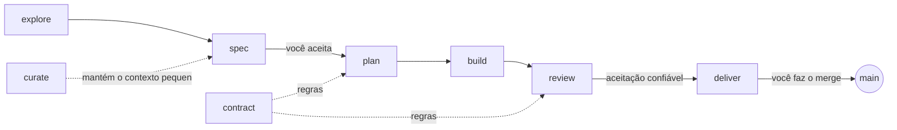

# AtipSpec

**Entrega guiada por especificação para clientes de programação com LLM. O
desenvolvedor conduz, o modelo propõe, a CLI verifica a evidência e a
aceitação confiável.**

Você continua conversando com o cliente de programação que já usa: Claude
Code, Codex, Cursor, GitHub Copilot, Gemini CLI ou Antigravity. O AtipSpec dá
ao modelo um manual de operação curto, um workflow por fase e uma ferramenta
de linha de comando que é dona de tudo o que não deve depender do julgamento
do modelo.

-   :material-file-document-check: **A spec é a verdade**

    Cada entrega começa com requisitos e critérios de aceitação que você
    aceita com um comando; se alguém os editar depois, o portão pergunta de
    novo. O revisor julga o código contra eles, critério por critério.

-   :material-shield-check: **O contrato é a lei**

    Um contrato de arquitetura com regras verificadas por máquina: stack,
    camadas, dependências, comandos obrigatórios. O desvio é recusado, não
    discutido.

-   :material-check-decagram: **Evidência com procedência autenticada**

    `atipspec verify` executa seus comandos de teste e registra os códigos de
    saída vinculados à árvore de trabalho. O sucesso local é `checked`;
    `verified` exige também evidência de CI assinada e aprovações humanas
    vinculadas ao conteúdo.

-   :material-source-branch: **Git é a máquina de estados**

    Uma tarefa está concluída quando um commit diz isso. Sem arquivo de
    estado, nada a retomar, nada a perder.

-   :material-account-eye: **Uma revisão adversarial**

    Um revisor em um contexto limpo lê um pacote, não a sua conversa, e
    escreve um PASS ou FAIL por critério.

-   :material-scale-balance: **Um contexto que continua pequeno**

    `atipspec context` carrega exatamente o que uma entrega precisa e mede
    isso contra um orçamento. O custo depende da entrega, não da idade do
    projeto.

## O fluxo em trinta segundos

1. **explore** uma ideia que ainda não está clara, se necessário.
2. **spec** com o modelo em uma entrevista; você aceita a spec com
   `atipspec accept`, ou **fix** um defeito sem entrevista.
3. **plan** as tarefas dentro do contrato, com os arquivos que vão tocar.
4. **build** tarefa por tarefa; cada tarefa termina com evidência e um commit.
5. **review** por um revisor que não escreveu o código.
6. **deliver**: a spec viva é atualizada, a entrega é arquivada, você faz o merge.

A aceitação humana é explícita: produto aceita a spec, engenharia o plano e QA
o candidato revisado com evidência de CI atestada. Veja a
[aceitação empresarial](enterprise.md) para configurar o perímetro de
confiança.

[Instalar o AtipSpec](getting-started/installation.md){ .md-button .md-button--primary }
[Primeiros passos](getting-started/quick-start.md){ .md-button }
